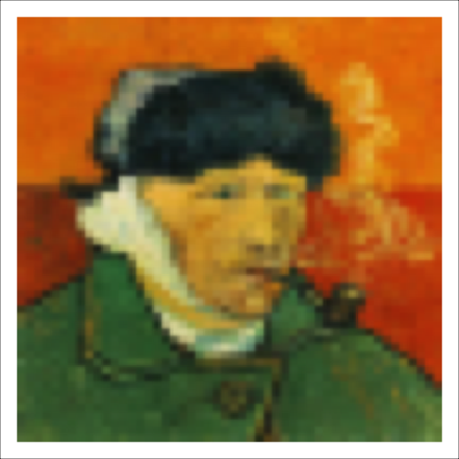
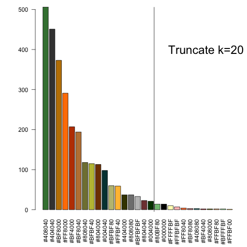

Palette Extractor: how it works
========================================================
width: 1200
height: 1000
author: Gabriel Arellano
date: October 25, 2014

Humans recognize color trends in images. But it is difficult to implement an authomated method to do so:

- Many pixels
- Each pixel with virtually a different color
- Each color with very different frequency

Here I present the basics of the app, with some code hints.

Enjoy it!

Reads image
========================================================

The Palette Extractor app reads any jpg image provided by the user, by making use of `readJPEG` function in jpeg package:


```r
image <- readJPEG(input$file$datapath)
```

 

Reduces resolution
========================================================
It reduces resolution with `aggregate` function in raster package:

```r
FACT <- round(sqrt(dim(image)[1]*dim(image)[2]/3000))
new <- list()
for(i in 1:dim(image)[3]) {
      x <- image[,,i]
      r <- raster(list(x=1:nrow(x), y=1:ncol(x), z=x))
      new[i] <- list(t(as.matrix(aggregate(r, fact=FACT))))
}
image <- abind(new[[1]], new[[2]], new[[3]], along=3)
```

 

```


Rounds Red, Green and Blue channels
========================================================

The basic color clustering method implemented is progressive rounding of R, G, and B channels of all pixels, stored in the matrix `RGB0`, according to the number of final colors specified `k`:


```r
kref = c(k:(k+round(k/3))) # desired output + some margin
upper <- 1000 # round to the thousandth
lower <- 1 # round to the unit
N0 <- 0
for(i in 1:50){
  a <- round((upper+lower)/2) # precission parameter
  RGB.not.unique <- round(RGB0*a)/a # useful later
  RGB <- unique(RGB.not.unique)
  N = nrow(RGB) # number of colors
  # pseudo divide and conquer algorithm:
  if(N < kref[1]) lower <- a # if too few: search above current a
  if(N > kref[length(kref)]) upper <- a # if too many: search below current a
  if(N == N0) break() # breaks if no improvement
  if(N %in% kref) break() # or if we have an acceptable number of colors
  N0 <- N
}
```

Selects most frequent colors
========================================================

The `kref` vector tends to select too many colors. The app just truncates the least frequent colors to have only `k`colors:


```r
COL.not.unique <- rgb(RGB.not.unique[,"R"], RGB.not.unique[,"G"], RGB.not.unique[,"B"])
freq.col <- sort(table(COL.not.unique), decreasing=T)
freq.col <- freq.col[1:k] # truncates to k
```

 


